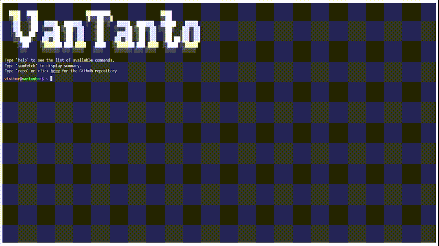

# [💻 vterminal - build terminal styled websites in minutes!](https://vantanto.my.id)

Interactive terminal to display profile, portfolio, social links and additional info. Powered by Javscript and Jquery.

Work with file: `config.js`. After you cloned this repository, simply edit `config.js` and `live-server` to run!

Feel free to visit my persnal website for the demo!

## 📸 Showcase

<p align="center">
<br>
<strong><a href="https://vantanto.my.id" target=_blank>my personal website</a></strong>
</p>

## 🚀 Ship vterminal

vterminal requires the `live-sever` for **local development**. You can install `live-server` using `npm package` [here](https://www.npmjs.com/package/live-server).

Simply you can clone this repository:

```bash
git clone https://github.com/vantanto/vterminal.git && cd vterminal
```

Then run `live-server` and start developing there:

```bash
live-server
```

Start editing `config.js` and try saving and see the updated changes!

## 📄 Configuration

### Basic Configuration

vterminal's configurations `config.js` file.

```javascript
{
  "readmeUrl": // create a Github README and link it here!
  "title": // title of the website
  "name": // your name, included in 'about' command
  "ascii": // ascii art to display
  "social": {
    "github": // your handle
    "linkedin": // your handle
  },
  "email": // your email
  "ps1_hostname": "liveterm" // hostname in prompt
  "ps1_username": "visitor", // username in prompt
  "resume_url": "../resume.pdf", // path to your resume
}
```

Feel free to change it as you see fit!

### Themes

You can find several pre-configured themes in `themes.css`, and you can replace the colors in `assets/css/style.css` with the theme color you like! The themes are based on the themes on [this website](https://glitchbone.github.io/vscode-base16-term/#/).

```css
:root {
	--dark-background: #282a36;
	--dark-foreground: #f8f8f2;
	--dark-yellow: #ffb86c;
	--dark-green: #50fa7b;
	--dark-gray: #bd93f9;
	--dark-blue: #8be9fd;
	--dark-red: #ff5555;
	--light-background: #FFFFDB;
	--light-foreground: #282a36;
	--light-yellow: #ffb86c;
	--light-green: #50fa7b;
	--light-gray: #8B6BB9;
	--light-blue: #67AFC0;
	--light-red: #ff5555; 
}
```

### Favicons

Favicons are located in `assets/img/`, along with the other files you may want to upload to your website.

### Banner

You may also want to change the output of the `banner` command. To do that, simply paste your generated banner in `assets/js/bin/commands.js`. I used this [website](https://manytools.org/hacker-tools/ascii-banner/) to generate my banner.

## 📝 Credit

Copyright © 2022 [Liveterm](https://github.com/Cveinnt/LiveTerm), [jquery-console](https://github.com/chrisdone/jquery-console).<br />
This project is [MIT](https://github.com/vantanto/vterminal/blob/master/LICENSE) licensed.
